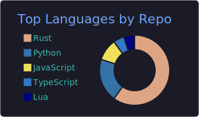
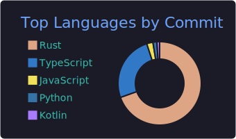

# Eliott Humes

Business Analytics @ CSUSM. Rust, Python, SQL.

## Projects
- **[grimoire](https://github.com/Slush97/grimoire)** — Mod manager for Deadlock (TS/Electron)
- **[adbridge](https://github.com/Slush97/adbridge)** — Android device bridge for AI dev (Rust + MCP)
- **[scry-index](https://github.com/Slush97/scry-index)** — Concurrent learned-index KV map (Rust)
- **[esolearn](https://github.com/Slush97/esolearn)** — ML toolkit in pure Rust

## Languages

  
  

## Contact
humeseliott@gmail.com · [eliott.info](https://eliott.info) · [linkedin](https://linkedin.com/in/e-humes/)

